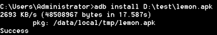

# 环境

真机需要打开usb调试
模拟器走127.0.0.1：xxxx 回环

* * *

# 命令

## 设备

1. 查看连接到PC的android设备列表及设备状态
`adb devices`
*设备有3种状态，device：正常连接，offline：设备连接异常，无响应，unknown：没有连接设备（无输出信息）*

2. 列表项获取设备的状态
`adb get-state`

3. 连接手机
`adb connect/disconnect 127.0.0.1:xxxx`
*列表项注册表查询不同模拟器的端口号*
*列表项对于真机，可以使用该命令通过WiFi进行远程调试，在进行设置之后我们就可以不需要通过USB线将手机连接到电脑了：*
- *确保手机和电脑处于同一网络中（连接的同一个路由器）；*
- *将手机通过usb线连接到电脑；*
- *输入adb tcpip 5555来确定手机与电脑远程通讯的端口号；*
- *拔掉usb线；*
- *再通过adb connect 加上你自己手机的ip地址来进行连接，如果想要取消连接，直接使用adb disconnect命令即可。*

* * *

## 常用操作命令

1. 查看帮助手册
`adb --help`

2. 查看adb版本信息
`adb version`

3. 进入shell
`adb shell`

4. 以root权限运行adb
`adb root`

5. 启用
`adb start-server`
*一般无需手动执行此命令，在运行adb 命令时若发现adb server 没有启动会自动调起,启动adb服务
通常在adb出现问题时，结合kill-server一起来重启adb服务*

6. 停止
`adb kill-server`

* * *

## 应用相关

### 安装、卸载应用

1. 安装命令
`adb install [-l] [-r] [-t] [-s] [-d] [-g] <apk-file>`
*adb install 后面可以跟一些可选参数来控制安装 APK 的行为，可用参数及含义如下：*

| 参数  | 含义  |
| --- | --- |
| -l  | 将应用安装到保护目录 /mnt/asec |
| -r | 允许覆盖安装 |
| -t | 允许安装 AndroidManifest.xml 里 application 指定android:testOnly=“true 的应用 |
|-s | 将应用安装到 sdcard |
| -d | 允许降级覆盖安装 |
| -g | 授予所有运行时权限 |

2. 覆盖安装
`adb install -r <apk路径>`
`adb install -r *.apk`
*保留数据和缓存文件，重新安装apk*

3. 查看应用列表
`adb shell pm list packages [-f] [-d] [-e] [-s] [-3] [-i] [-u] [--user USER_ID] [FILTER]`
*adb shell pm list packages 后面可以跟一些可选参数进行过滤查看不同的列表，可用参数及含义如下：*

| 参数| 显示列表| 
|-|-| 
| -f | 显示应用关联的 apk 文件 | 
| -d| 只显示 disabled 的应用| 
| -e| 只显示 enabled 的应用| 
| -s| 只显示系统应用| 
| -3| 只显示第三方应用| 
| -i| 显示应用的 installer| 
| -u| 包含已卸载应用| 
|\<filter>| 包名包含 \<filter> 字符串| 

4. 显示所有应用
`adb shell pm list packages` 

5. 只显示系统应用
`adb shell pm list packages -s` 

6. 只显示第三方应用
`adb shell pm list packages -3` 

7. 完全卸载
`adb uninstall <包名>` 
*卸载某个应用，后面就需要加上对应的包名*

8. 保留配置文件
`adb uninstall -k <包名>` 
*卸载应用但保留数据和缓存文件*

9. 启动应用
`adb shell am start -n <包名>/<Activity名>`

10. 清除应用数据与缓存
`adb shell pm clear <包名>`

11. 强制停止应用
`adb shell am force-stop <包名>`

12. 可输入部分包名进行筛选
例：`adb shell pm list packages com.tencent.`

13. 查看应用详细信息
`adb shell dumpsys package <package-name>`
*注：\<package-name> 表示应用包名，非app名称，如：com.tencent.mobileqq*

14. 查看应用安装路径
`adb shell pm path <package-name>`
例 `adb shell pm path com.tencent.mobileqq`
* * *
## 日志相关
1. 命令
`adb logcat [option] [filter-specs]`  或 `adb shell logcat`

2. 获取日志
`adb logcat`
*抓取android日志，这个也是对我们非常有用的命令，通过logcat日志，在app发生异常时，如crash/无响应这种，都可以在logcat里面定位到相应的信息*

3. 帮助信息
`adb logcat --help`

4. 清除旧日志信息
`adb logcat -c`

5. 开始抓取日志
`adb logcat -v time > .\logcat.log` 
*日志带有时间戳，日志写入当前目录的logcat.log文件*

6. 将日志写入123.txt文件内，并存入E盘根目录
`adb shell logcat -v time >E:\123.txt` 

7. 暂停录制
CTRL + C
* * *
## 系统操作
查看系统资源：`adb shell top | grep 包名`

查看 CPU 信息：`adb shell dumpsys cpuinfo`

查看内存信息：`adb shell dumpsys meminfo`

查看进程状态：`adb shell ps`

- 列表项查看Android设备系统信息

生产厂商：`adb shell getprop ro.product.brand`

系统版本：`adb shell getprop ro.build.version.release`

设备型号：`adb shell getprop ro.product.model`

电池状况：`adb shell dumpsys battery`

设备分辨率：`adb shell wm size`

屏幕密度：`adb shell wm density`

设备IMEI：`adb shell dumpsys iphonesubinfo`

Android id：`adb shell settings get secure android_id`

CPU 信息：`adb shell cat /proc/cpuinfo`

内存信息：`adb shell cat /proc/meminfo`

生产厂商：`adb shell getprop ro.product.brand`

系统版本：`adb shell getprop ro.build.version.release`

设备型号：`adb shell getprop ro.product.model`

电池状况：`adb shell dumpsys battery`

设备分辨率：`adb shell wm size`

屏幕密度：`adb shell wm density`

设备IMEI：`adb shell dumpsys iphonesubinfo`

Android id：`adb shell settings get secure android_id`

CPU 信息：`adb shell cat /proc/cpuinfo`

内存信息：`adb shell cat /proc/meminfo`
* * *
## 文件操作
1. 从手机拉取文件或文件夹放到本地电脑
`adb pull <手机路径> <电脑路径>`
*从手机中拉取信息放到本地电脑上，手机路径可以通过adb shell进入到shell环境中，通过cd、ls这些命令找到对应的文件，如将QQ这个apk安装包拉取放到D盘下的test目录：*
*似乎只支持一个进程*

2. 从本地推送文件或文件夹到手机上去 
`adb push <本机路径> <手机路径>`

3. 截图
将模拟器当前显示截图：`adb shell screencap <设备路径>`
将截图文件下载至电脑：`adb pull <截图所在的设备路径> <电脑路径>`

4. 切换文件目录
命令：adb shell cd  \<directory>
*使用adb shell 进入shell
使用cd  \<directory>进入指定目录，如：cd sdcard*

5. 列出指定目录的内容
`adb shell ls [options] <directory>`
*使用adb shell 进入shell
使用cd  \<directory>进入指定目录，如：cd sdcard
使用ls 查看该目录的内容*

|参数：||
|-|-|
|无：|列出当前目录下的所有内容，包含文件和子目录|
|-a：|列出当前目录下的所有内容，包含隐藏文件和隐藏文件夹|
|-i：|列出当前目录下的所有文件和索引编号|
|-s：|列出当前目录下的所有文件和文件大小|
|-n：|列出当前目录下的所有文件及其 UID和 GID|
|-R：|列出当前目录下的所有子目录中的文件|

6. 删除文件或目录
`adb shell rm [options] <files or directory>`

|参数||
|-|-|
|无：|删除文件|
|-f：|强制删除文件，系统不提示|
|-r：|强制删除指定目录中的所有文件和子目录|
|-d：|删除指定目录，即使它是一个非空目录|
|-i：|交互式删除，删除前提示|

7. 创建目录
`adb shell mkdir [options] <directory-name>`

|参数||
|-|-|
|无：|创建指定目录|
|-m：|创建指定目录并赋予读写权限|
|-p：|创建指定目录及其父目录|

8. 查看当前路径
`adb shell pwd`
* * *
